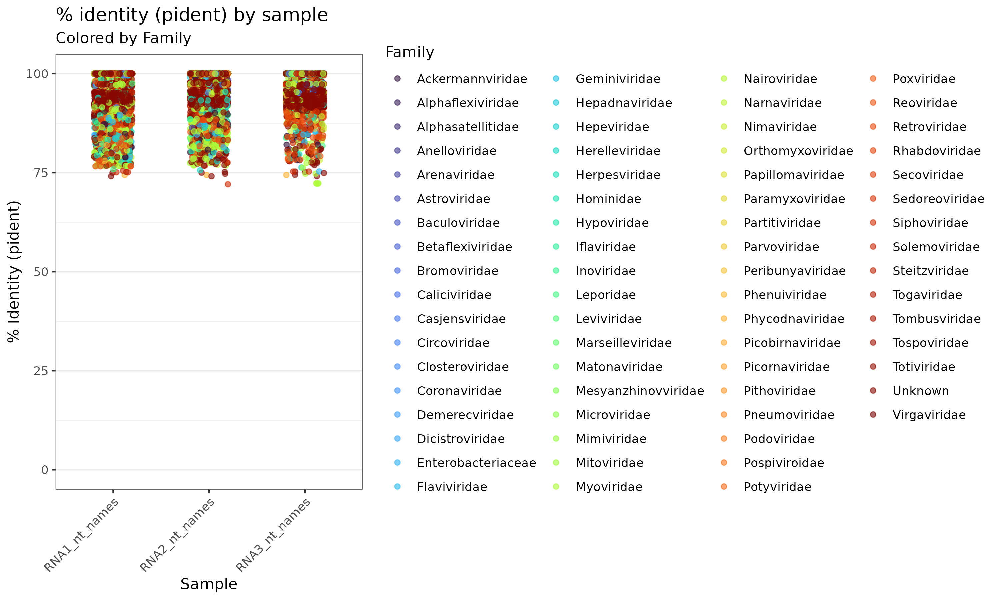

# Virus discovery workflow

This repository provides virus-discovery workflows configured for the powerPlant and Nesi HPC systems (Slurm). They accept your sequencing data and can be used to mine SRA datasets for mycoviruses. 

The workflow creates a standardized project folder structure and a set of scripts to speed up analysis. 


--------------------
### Table of Contents
- [Virus discovery workflow](#Virus-discovery-workflow)
    - [Table of Contents](#table-of-contents)
      - [Installation](#installation)
      - [Workflow](#Workflow)
      - [Acknowledgments](#acknowledgments)
      - [How to cite this repo?](#how-to-cite-this-repo)

--------------------

## Installation

1. Clone the repository: git clone https://github.com/cinthylorein/Virus_discovery_workflows.git

2. Change into the scripts directory: cd Virus_discovery_workflows/scripts

(If you downloaded and unpacked a ZIP from GitHub you may get a directory named Virus_discovery_workflows-main; adapt the path accordingly, e.g. cd Virus_discovery_workflows-main/scripts.)

3. Convert CRLF to Unix LF and then set the executable bit. From the repository root:

```bash
# Convert line endings for all top-level .sh files
sed -i 's/\r$//' *.sh

# On macOS (BSD sed) use:
# sed -i '' -e 's/\r$//' *.sh

# Alternative if you have dos2unix:
# dos2unix *.sh

# Then make scripts executable
chmod +x *.sh
```

4. Edit the setup.sh file: update the root, project and email variables to match your environment.

5. Run the setup script: ./setup.sh

Notes about the scripts

Each general task has two files: a .sh shell wrapper and a .slurm job script. The .sh file passes parameters and environment variables to the .slurm script. In normal use you usually only edit the .sh wrapper; the .slurm file typically does not need changes.
The scripts are designed to run on batches: they expect an input file listing sample filenames (one per line) to process multiple samples in a single run.

--------------------

## Workflow

This repository contains two virus‑discovery pipelines illustrated in the figure bellow. Use (A) when you know the host genome and want to remove host reads before virus discovery; use (B) when you do not remove host reads (environmental or unknown‑host samples) or when starting from SRA accessions.


### Overview

- Pipeline — host-aware (recommended when you have the host reference)
  - Purpose: remove host-derived reads first to reduce background, then assemble and search for viral contigs.
  - Typical use case: metatranscriptomes sequenced from a known host (e.g., *Botrytis cinerea*).
---

### Pipeline (host-aware) — step-by-step

1. Set up directories and environment
   - Run the project setup script that creates the standard folder layout:
2. Quality control (FastQC)
   - Input: raw FASTQ files in `scratch/.../raw_reads`.
   - Quick QC to check library quality before trimming.

3. Trim reads and assemble transcripts
   - Trimming: Trimmomatic (or equivalent) to remove adapters and low-quality bases.
   - Assembly: trinity/megahit/rna assembler to build contigs from trimmed reads.

4. Build host index and remove host reads
   - Build a Bowtie2 index of the host transcriptome/genome.
   - Align reads to host and remove aligned reads (keeps likely non‑host reads for viral discovery).

5. Assemble viral contigs
   - Assemble the host‑filtered reads (SPAdes).
   - Result: candidate contigs enriched for non‑host sequences.

6. BLAST/annotation/search steps
   - Run BLASTx and against NR/NT as needed.
   - Typical scripts:
     - `_blastx.sh`, `_blastnt.sh`
7. Create summary table and visualization
   - Outputs:
     - A CSV summary table (e.g. summary_table.csv) containing one row per contig/sample pair.
     - A figure file showing percent identity by sample (example: images/pident_by_sample.png). This plot helps quickly assess how similar candidate contigs are to known viruses across samples and to visualise family-level identification.
   - Example: Summary plot generated by the pipeline:

      The figure shows the initial BLASTx result of contigs from RNA libraries (Phytophthora RNA 1–3) sharing similarity with virus protein database post de novo assembly.

      


### Example: Summary table 

| contig_id | sample_id | contig_length | abundance_TPM | read_count | best_db | best_hit_accession | best_hit_description | percent_identity | align_length | evalue | bitscore | taxid | lineage | classification | notes |
|---|---:|---:|---:|---:|---|---|---|---:|---:|---:|---:|---:|---|---|---|
| contig_0001_sampleA | sampleA | 3258 | 1523.4 | 4821 | nr | YP_009724389.1 | RNA-dependent RNA polymerase [Hypothetical virus X] | 98.5 | 310 | 1e-120 | 460 | 12345 | Riboviria; Picornavirales; Caliciviridae; Norovirus | likely | RdRp hit high identity; RdRp-scan positive |
| contig_0002_sampleB | sampleB | 1412 | 210.1 | 873 | RVDB | RVDB_ABC12345 | Capsid protein [Uncharacterized virus Y] | 92.3 | 250 | 2e-60 | 320 | 67890 | Riboviria; Narnavirales; Narnaviridae; Mitovirus | likely | RVDB hit; taxid from RVDB mapping |
| contig_0005_sampleC | sampleC | 2187 | 320.9 | 1104 | RdRpScan | RdRp_000987654 | Conserved RdRp domain [novel virus fragment] | 89.9 | 400 | 3e-80 | 410 | 33445 | Riboviria; Unclassified_RdRp | likely | Detected by RdRp-scan; no close nr hit |


Note:
The pipeline depends on server-installed reference databases (NR, NT, RVDB, RdRp-Scan), software modules, and taxonomy files (NCBI taxdb, taxize, RVDB tax). These resources are not downloaded automatically and must be present on the server.

--------------------

## Acknowledgments
I'd like to acknowledge of the Holmes Lab for their contributions to the development of the USYD Artemis workflow which inspires this one.

--------------------

## How to cite this repo?
If this repo was somehow useful a citation would be greatly appeciated! Available at: https://github.com/cinthylorein/Virus_discovery_workflows.
