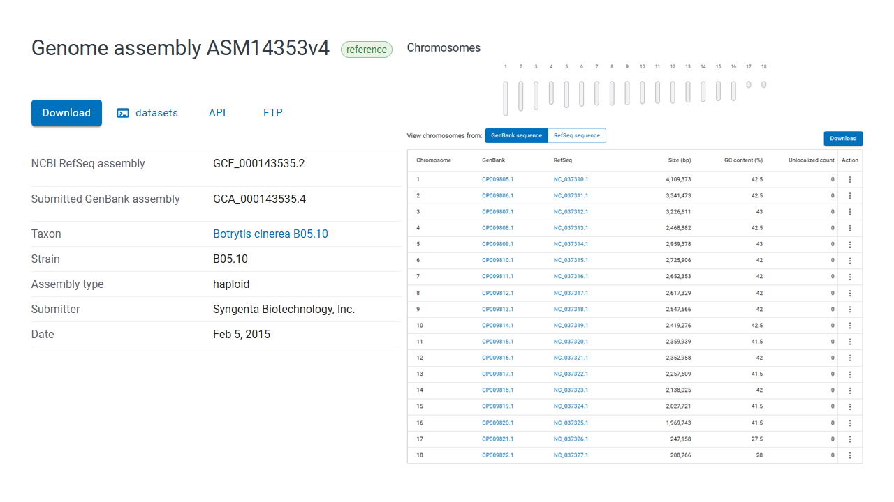
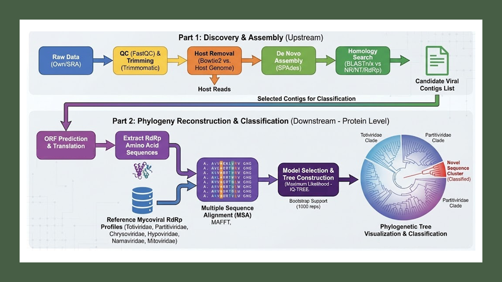
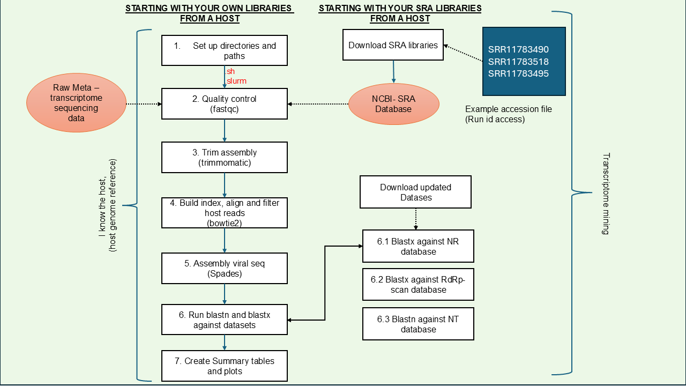

# Mycovirus discovery workflows (Slurm/HPC)

This repository provides virus-discovery workflows configured for **PowerPlant** and **NeSI** HPC systems (Slurm). The workflows accept your sequencing data and can be used for virus discovery with a particular focus on **mycoviruses** (including SRA mining workflows).

The pipeline creates/uses a standardized project folder structure and a set of scripts to speed up analysis.

---

## Table of contents
- [Quick start](#quick-start)
- [Repository layout](#repository-layout)
- [Configuration (`config/pipeline.env`)](#configuration-configpipelineenv)
- [Workflow overview](#workflow-overview)
- [Step-by-step scripts (host-aware pipeline)](#step-by-step-scripts-host-aware-pipeline)
- [Outputs](#outputs)
- [HPC tips (logs, monitoring, reruns)](#hpc-tips-logs-monitoring-reruns)
- [Acknowledgments](#acknowledgments)
- [How to cite this repo](#how-to-cite-this-repo)

---

## Quick start

### 1) Clone the repository
```bash
git clone https://github.com/cinthylorein/Mycovirus_discovery_workflows.git
cd Mycovirus_discovery_workflows
```

### 2) Make scripts executable (and fix CRLF if needed)
If you edited files on Windows and see `/bin/bash^M` errors, convert line endings to Unix LF:

```bash
# from repo root
find Scripts -type f \( -name "*.sh" -o -name "*.slurm" \) -print0 | xargs -0 sed -i 's/\r$//'
or 
chmod +x Scripts/*.sh
```

### 3) Create your pipeline configuration
This pipeline expects a config file (example path below):
- `config/pipeline.env`

Create it (or copy from an example if you add one later), and set directories such as:
- `RAW_DIR`, `TRIM_DIR`, `MAPPING_DIR`, `CONTIGS_DIR`, `BLAST_DIR`, `LOG_DIR`, `ADAPTER_DIR`, etc.

Then run wrappers like:
```bash
cd Scripts

# Option A: set CONFIG once per session
export CONFIG="$PWD/../config/pipeline.env"

# Run 
./1_setup.sh
./2_pipeline_fastqc.sh
./3_pipeline_trim.sh
./4_pipeline_bowtie2.sh
./5_pipeline_spades.sh
./6_pipeline_blastx.sh
./7_pipeline_summary_result.sh
```

# Run all script 

./0_Run_all.sh (will run part 1 of the workflow)

---

## Repository layout

Top-level:
- `Scripts/` — pipeline wrappers (`*.sh`) and Slurm job scripts (`*.slurm`)
- `adapters/` — adapter FASTA files (e.g. `Illumina.fa`)
- `accession_lists/` — lists of accessions (if running SRA workflows). There is an example file to test before run your own data. 
- `images/` — workflow diagrams and example plots
- `README.md`

> Convention used in this repo: most steps have two files:
> - a `*.sh` wrapper (sets config, creates directories, submits Slurm jobs)
> - a `*.slurm` job script (runs on the cluster)

---

## Configuration (`config/pipeline.env`)

The pipeline is designed to avoid hardcoded `/workspace/...` paths. Instead, you define your project layout in an environment file and export it when submitting jobs.

Typical variables include:

- `RAW_DIR` — raw FASTQs (e.g. `.../raw_reads`)
- `TRIM_DIR` — trimmed reads
- `MAPPING_DIR` — Bowtie2 non-host reads
- `CONTIGS_DIR` — assembly output (SPAdes contigs)
- `BLAST_DIR` — BLAST outputs
- `LOG_DIR` — Slurm stdout/stderr logs for wrappers/jobs
- `ADAPTER_DIR` — adapter FASTA location

Cluster-specific tools/DBs may also be configured via variables:
- `TRIMMOMATIC_JAR`
- `REF` (host reference fasta for Bowtie2 index)
Note: If you are running the example or your metatranscriptomic are from *B cinerea*. Here there is the genome of reference that was used. 



- `BLASTDB_NT`, `BLASTDB_RDRP`, `BLASTDB_RVDB`, etc.

---

## Workflow overview

This repository contains host-aware virus-discovery-characterization approaches (see image).



### Host-aware pipeline part 1 virus-discovery(typical)
1. Set up directories
2. QC raw reads (FastQC)
3. Trim adapters/low-quality bases (Trimmomatic)
4. Build Bowtie2 index + remove host reads
5. Assemble non-host reads (SPAdes rnaviralspades)
6. Search contigs with BLASTx / databases
7. Summarize results + plots (R)


---

## Step-by-step scripts (host-aware pipeline)

Run these from `Scripts/` (each wrapper submits Slurm jobs):

2. **FastQC**  
   - Wrapper: `Scripts/2_pipeline_fastqc.sh`  
   - Slurm: `Scripts/2_pipeline_fastqc.slurm`  
   - Input: `$RAW_DIR`  
   - Output: `$FASTQC_DIR`

3 **Trimming (Trimmomatic)**  
   - Wrapper: `Scripts/3_pipeline_trim.sh`  
   - Slurm: `Scripts/3_pipeline_trim.slurm`  
   - Input: `$RAW_DIR`  
   - Output: `$TRIM_DIR`

4. **Host removal (Bowtie2)**  
   - Wrapper: `Scripts/4_pipeline_bowtie2.sh`  
   - Slurm: `Scripts/4_pipeline_bowtie2_build_index.slurm`, `Scripts/4_pipeline_bowtie2.slurm`  
   - Input: `$TRIM_DIR`  
   - Output: `$MAPPING_DIR` (non-host paired reads)

5. **Assembly (SPAdes / rnaviralspades)**  
   - Wrapper: `Scripts/5_pipeline_spades.sh`  
   - Slurm: `Scripts/5_pipeline_spades.slurm`  
   - Input: `$MAPPING_DIR`  
   - Output: `$CONTIGS_DIR/<sample>/contigs.fasta`

6. **Search / annotation (BLASTx)**  
   - Wrapper: `Scripts/6_pipeline_blastx.sh`  
   - Slurm: `Scripts/6_pipeline_blastx_nr.slurm`  
   - Input: `$CONTIGS_DIR/*/contigs.fasta`  
   - Output: `$BLAST_DIR/*`

7. **Summaries + plots (R)**  
   - Wrapper: `Scripts/7_pipeline_summary_result.sh`  
   - Slurm: `Scripts/7_pipeline_summary_result.slurm`  

---

## Outputs

Typical outputs:
- QC: FastQC HTML and zip reports
- Trim: paired + unpaired FASTQs + per-sample trimming logs
- Mapping: non-host paired reads from Bowtie2
- Assembly: `contigs.fasta` per sample
- BLAST: per-sample results tables (`.tsv` / `.csv`)
- Summary: combined tables + plots (e.g., percent identity plots)

---

### Host-aware pipeline part 1 virus-characterization

8.	ORF prediction and Traslation
9.	Extract RdRp/Rep Amino Acid Sequences and add to Reference Mycoviral families alignments 
10.	Multiple Sequence Alignment
11.	Model Selection and Tree reconstruction 


## HPC tips (logs, monitoring, reruns)

### Where are logs?
- Wrapper-submitted Slurm logs are written to `$LOG_DIR` (e.g. `fastqc_%A_%a.out`)
- Many steps also write per-sample tool logs into step-specific `logs/` directories.

### Monitor jobs
```bash
squeue -u $USER
sacct -j <jobid>
```

### Rerun a failed array task
```bash
# example: rerun only task 7 of array job 123456
sbatch --array=7 Scripts/<job>.slurm
```

### Check SRA download completeness (optional)
If you are downloading SRA reads (e.g., `SRR*`) as part of the workflow, you can verify that all expected accessions were downloaded (and that paired-end downloads have both `_1` and `_2` files) using:

```bash
bash Scripts/pipeline_check_sra_downloads.sh \
  -f /workspace/hraczj/Virus_discovery_workflows/MVoPvirome/MVoP_pipeline/accession_lists/accessions.txt \
  -d /workspace/hraczj/Virus_discovery_workflows/MVoPvirome/MVoP_pipeline/raw_reads
```

If any runs are missing or partially downloaded, the script will create `missing_sra_ids.txt` in the `-d` directory, which you can use as input for a re-download.

If you dont have access to powerplant and you want to run this workfow in your slurm HPC, you should set up the modules and the databases to blast agains. 

### SLURM job scripts for updated Databases in you HPC
Here there are script for download Databases:
(Scripts/NCBI_database_nr_update.slurm and Scripts/NCBI_database_nt_update.slurm) to automate updating the NCBI nr and nt BLAST databases using update_blastdb.pl. Each script loads ncbi-blast/2.11.0, configures job resources (2 CPUs, 10G RAM, walltime), logging and email notifications, and sets a DBDIR pointing to the target database directory. Note: the update_blastdb.pl calls currently pass the literal string "DBDIR" as --source; this should be changed to use the variable (e.g. --source "$DBDIR") or the actual directory path.

Note: please set up your eviroment paths according to where you will run your analysis (HPC locations) 
---

## Acknowledgments
Inspired by workflows developed in the Holmes Lab (USYD Artemis workflow).

---

## How to cite this repo
If this repository is useful in your work, a citation would be appreciated:

- Repository: https://github.com/cinthylorein/Mycovirus_discovery_workflows